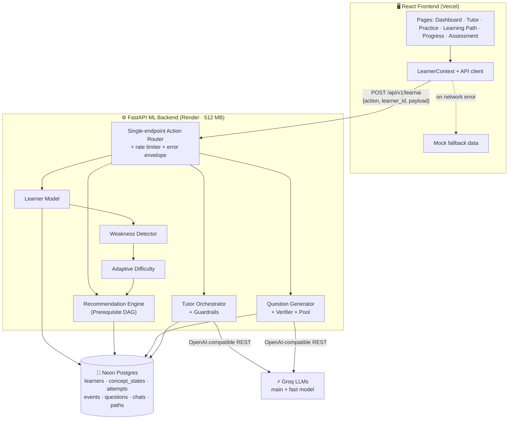
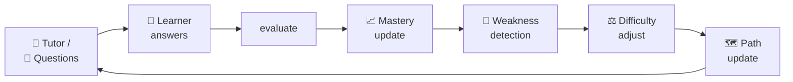
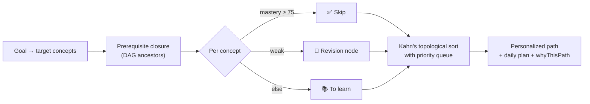
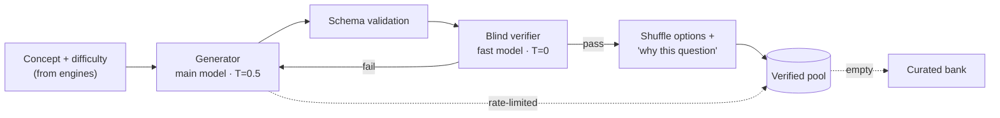

<div align="center">

# 🎓 LearnAI — Personalized AI Tutor

### An adaptive learning platform that teaches AI/ML the way *you* need to learn it

**It diagnoses what you know, finds where you struggle, adapts difficulty in real time, and rebuilds your learning path after every answer.**

[](https://ai-tutor-mauve-kappa.vercel.app/)
[](https://learnai-ml-backend.onrender.com/health)
[](https://learnai-ml-backend.onrender.com/docs)


</div>

---

## 📌 Table of Contents

- [The Problem](#-the-problem)
- [The Solution](#-the-solution)
- [Live Demo](#-live-demo)
- [Key Features](#-key-features)
- [System Architecture](#-system-architecture)
- [The Closed Learning Loop](#-the-closed-learning-loop)
- [ML Intelligence Layer — Deep Dive](#-ml-intelligence-layer--deep-dive)
- [LLM Pipeline & Guardrails](#-llm-pipeline--guardrails)
- [API Reference](#-api-reference)
- [Tech Stack](#-tech-stack)
- [Project Structure](#-project-structure)
- [Getting Started](#-getting-started)
- [Environment Variables](#-environment-variables)
- [Deployment](#-deployment)
- [Testing & Evaluation](#-testing--evaluation)
- [Performance](#-performance)
- [Demo Walkthrough](#-demo-walkthrough)
- [Roadmap](#-roadmap)
- [Team](#-team)

---

## ❗ The Problem

Traditional AI/ML education treats every learner identically. A developer with two years of Python and a complete beginner get:

- the **same** lecture videos and explanations,
- the **same** math depth (either too opaque or too dumbed down),
- the **same** practice problems and fixed linear curriculum,
- the **same** pace.

When a learner fails a fundamental concept like the *Bias–Variance Tradeoff*, most platforms just mark it wrong and move on. Gaps compound until the learner gets overwhelmed and drops out.

## 💡 The Solution

LearnAI turns learning into a **closed feedback loop**. It continuously estimates each learner's knowledge state per concept, detects weaknesses immediately, calibrates question difficulty, and restructures the roadmap, while an AI tutor explains every concept at the learner's exact level.

> Same question, different learner, different answer.
> Ask *"What is gradient descent?"* as a **beginner** and you get a foggy-hill analogy with 5 lines of commented Python.
> Ask it as an **advanced** learner and you get the update rule, a Taylor-expansion derivation, and SGD/momentum/Adam trade-offs.

---

## 🌐 Live Demo

| | Link |
|---|---|
| 🖥️ **Frontend (Web App)** | https://ai-tutor-mauve-kappa.vercel.app/ |
| ⚙️ **ML Backend API** | https://learnai-ml-backend.onrender.com |
| 📘 **Interactive API Docs** | https://learnai-ml-backend.onrender.com/docs |
| ❤️ **Health Check** | https://learnai-ml-backend.onrender.com/health |

**Demo personas** (switch from the profile switcher in the app):

| Persona | Level | Goal | Profile |
|---|---|---|---|
| **Alex** | Beginner | Learn ML from scratch | Basic Python, weak on matrix shapes & variance |
| **Akshat** | Intermediate | Become an ML Engineer | Strong Python, weak on bias–variance & gradient descent |
| **Elena** | Advanced | Build GenAI apps | Senior DS, weak on vector-DB chunking & semantic drift |

> ⏳ The backend runs on Render's free tier, so the first request after idle can take 30–60 seconds while it wakes up.

---

## ✨ Key Features

### 🧠 Adaptive Intelligence (ML Backend)
- **Learner Model**: per-concept mastery, confidence and trend tracking across 26 AI/ML concepts.
- **Weakness Detector**: priority-scored weaknesses (HIGH / MEDIUM / LOW) with human-readable reasons and tutor alerts.
- **Adaptive Difficulty Engine**: picks Easy / Medium / Hard from the last 5 answers, time taken and confidence, not just the score.
- **Recommendation Engine**: builds a personalized learning path over a prerequisite DAG; skips what you know and injects revision for what you don't.
- **Cold-Start Profiler**: turns a 6-step onboarding questionnaire into a baseline knowledge vector and a first roadmap.

### 🤖 AI Tutor
- **9 learning modes**: explanation, simplify, example, code, practice, hint, evaluate, revision, path.
- **Level-calibrated depth**: analogies for beginners, sklearn + loss functions for intermediates, paper-level mechanics for advanced learners.
- **Hinglish support**: replies in the learner's own language register.
- **Verified checkpoint questions** inside explanations.
- **Production guardrails**: prompt-injection defence, off-topic redirect, answer-leak prevention in hints, distress handling.

### 📝 Adaptive Practice
- **LLM-generated questions** targeted at detected gaps, with varied real-world scenarios.
- **Independent answer verification**: a second model solves every question; wrong or ambiguous ones never reach the learner.
- **"Why this question?"** explanation for every question, built from the learner's real data.
- **Verified question pool** so practice keeps working even under AI rate limits.

### 📊 Frontend Experience
- Dashboard with a live **"Your tutor adapted your path"** banner.
- **Skill radar** across Python, Statistics, ML, DL, NLP and GenAI.
- **Dynamic learning path** with completed / current / adapted / locked nodes.
- In-lesson tutor sidebar with "Explain simpler" and "Give me an example".
- **Graceful fallback**: if the backend is unreachable, the app switches to local tutor mode instead of breaking.

---

## 🏗️ System Architecture



### Design decisions

| Decision | Why |
|---|---|
| **One endpoint, many actions** | One URL for the frontend, one error envelope, one place for rate limiting. |
| **Rule-based engines + LLM only where it adds value** | Mastery, weakness, difficulty and path logic are deterministic, testable and instant. The LLM is used only for language: tutoring, question writing and summaries. |
| **No local ML models** | Torch/transformers alone would blow past the 512 MB limit. The whole backend runs at ~80 MB peak. |
| **Generator + independent verifier** | LLMs write plausible but sometimes wrong MCQs. A second model solving each question blind catches them. |
| **Facts computed in Python, never by the LLM** | "Why this question", "next action" and learner numbers come from real data, so the tutor can't hallucinate scores. |
| **Neon Postgres** | Render's disk is ephemeral; learner progress and the question pool must survive restarts. |

---

## 🔄 The Closed Learning Loop



Every single answer flows through the full loop. The tutor and question generator always see the **updated** learner state on the next turn.

---

## 🔬 ML Intelligence Layer — Deep Dive

### 1. Learner Model

Each learner has a state for every concept:

```json
{
  "concept": "bias_variance",
  "mastery": 54.0,
  "attempts": 8,
  "correct": 4,
  "recentAccuracy": 0.5,
  "confidence": 0.72,
  "trend": "improving"
}
```

**Mastery update rules** (difficulty-aware and saturation-aware):

| | Easy | Medium | Hard |
|---|:---:|:---:|:---:|
| ✅ Correct | +3 | +5 | +8 |
| ❌ Wrong | −8 | −6 | −3 |

- Gains are scaled by `(1 − mastery/100) × 1.5`, so learning slows near mastery.
- Losses are scaled by `(mastery/100) × 1.5`, so a slip hurts more when you "should" know it.
- Fast correct answers (< 20 s) get a +1 bonus. Mastery is clamped to 0–100.
- **Confidence** = `min(1, attempts/10) × (1 − 0.15 × min(consecutive_wrong, 3))`
- **Trend** compares the accuracy of the last 3 answers against the previous 3 (±0.15 threshold).
- **Category skill score** = attempt-weighted average of concept masteries in that category.

### 2. Weakness Detector

Concepts are classified as **Strong (≥ 75)**, **Average (60–74)** or **Weak (< 60)**, plus a relative rule (below 75 and ≥ 15 points under the learner's own average). Untried concepts are never marked weak.

**Priority score (0–100):**

```
0.45 × (100 − mastery)
+ 0.20 × consecutive mistakes (capped at 3)
+ 0.15 × (100 − recent accuracy)
+ 0.10 × trend penalty (declining > stable > improving)
+ 0.10 × evidence (number of attempts)
```

`HIGH ≥ 55 · MEDIUM 40–54 · LOW < 40`. HIGH triggers a tutor alert:

> *"Your tutor noticed you're struggling with Overfitting."*
> 5 attempts · 40% recent accuracy · 3 consecutive mistakes · trend declining → revise **Bias vs Variance** first.

Each weakness also gets a `recommended_revision`: its weakest unmastered prerequisite from the DAG.

### 3. Adaptive Difficulty Engine

Uses the last 5 answers, their difficulty, time taken, mastery and confidence. Rules apply in order:

| Situation | Decision |
|---|---|
| 2 wrong in a row at Hard | ⬇️ Medium (reinforce before retrying Hard) |
| 2 wrong in a row at Medium | ⬇️ Easy |
| 2+ wrong in the last 3 | ⬇️ One level down |
| 3 correct at the same level, fast | ⬆️ One level up |
| 3 correct at the same level | ⬆️ Up if mastery allows (≥ 60 for Medium, ≥ 75 for Hard) |
| Correct but slow (> 1.5× expected time) | ➡️ Stay |

**Example:** `Easy ✓ → Medium ✓ → Medium ✓ → Hard ✗ → Hard ✗` → next question is **Medium reinforcement**, not another Hard.

Every quiz produces an **AdaptiveEvent** (`reduced` / `maintained` / `increased`) using the `< 60 / 60–84 / ≥ 85` thresholds. The difficulty engine can override the raw score, and the event explains why.

### 4. Recommendation Engine & Learning Path



**Ordering priority** among available nodes:
1. Revision nodes (by weakness priority)
2. Prerequisites of a weak concept (fix the foundation first)
3. Goal relevance (shortest DAG distance to a target)
4. Category order (Python → Stats → ML → DL → NLP → GenAI)

Learners who know no programming language get Python foundations first.

**Same goal, different learners, different paths:**

```
Learner A (knows Python, weak Stats)        Learner B (strong across ML)
Python ─────────── ✓ skipped                Python ─────────── ✓
Statistics ─────── → revision               Statistics ─────── ✓
ML Fundamentals ── →                        ML ─────────────── ✓
Deep Learning ──── 🔒                       Deep Learning ──── →
                                            Generative AI ──── →
```

Every path change is snapshotted and diffed, so the dashboard can show a real **before/after**:

> *Before: next up was Probability Fundamentals. After: Overfitting & Underfitting revision added.*

### 5. Cold-Start Profiler

The 6-step assessment (experience, languages, known topics, goal, pace, daily time) becomes a baseline mastery vector:

- Known topics → 78, and their DAG ancestors at least 70 (knowing ML implies the basics).
- Python known → Python concepts 80; no language → 15.
- Everything else → baseline by experience (15 / 25 / 40 / 55), never above its prerequisites.
- Then the first path, a `whyThisPath` summary and 3 diagnostic concepts are generated.

---

## 🛡️ LLM Pipeline & Guardrails

### Question Generation Pipeline



- The verifier sees **only** the question and options, solves it independently, and rejects mismatches, multiple-correct options, flawed questions, low-confidence answers, and questions far from the requested difficulty.
- Options are shuffled server-side to remove the LLM's answer-position bias.
- Anti-repetition rotates **10 scenario domains** (healthcare, finance, autonomous vehicles…) and **6 question angles** (formula, curve diagnosis, code debugging…).

### Tutor Guardrails

| Layer | Protection |
|---|---|
| **Input** | Control-char stripping, 2000-char limit, injection / distress / off-topic detection |
| **Prompt** | Learner message wrapped in tags and treated as data; scope limited to AI/ML learning |
| **Off-topic** | Answered from a template **without** calling the LLM (saves quota) |
| **Hint mode** | Rejects replies that leak or quote the correct option |
| **Leakage** | Sentinel-phrase check against system prompt exposure |
| **Facts** | Learner numbers only from context; no invented papers, URLs or APIs |
| **Formatting** | KaTeX delimiter balancing; Beginner math must be explained in plain English |
| **Wellbeing** | Distress → warm response + support line, no tutoring push |
| **Repair** | One targeted repair call on violation, then a safe fallback |

### Per-Mode Temperature

| Mode | Temp | | Mode | Temp |
|---|:---:|---|---|:---:|
| explanation | 0.5 | | hint | 0.3 |
| simplify | 0.6 | | evaluate | 0.1 |
| example | 0.7 | | revision | 0.3 |
| code | 0.2 | | path | 0.3 |
| practice | 0.4 | | verifier | 0.0 |

Prompts are versioned templates (`app/prompts/`) composed as **Role → Guardrails → Learner context → Level rules → Mode rules → Output schema**.

---

## 📡 API Reference

Everything goes through **one endpoint**:

```http
POST /api/v1/learnai
Content-Type: application/json
```

```json
{
  "action": "tutor_chat",
  "learner_id": "akshat-intermediate",
  "payload": { "message": "Why does my model overfit?" }
}
```

Every response uses the same envelope:

```json
{
  "success": true,
  "action": "tutor_chat",
  "data": { "...": "..." },
  "error": null,
  "fallback_data": null
}
```

| Action | Purpose | LLM |
|---|---|:---:|
| `get_profile` | Learner profile, skills, weakness report, recent adaptive events | ❌ |
| `reset_learner` | Restore a demo learner to its seeded state | ❌ |
| `evaluate` | Grade one answer or a whole quiz → full adaptive loop | ❌ |
| `generate_questions` | Personalized, verified MCQs with "why this question" | ✅ |
| `tutor_chat` | AI tutor with 9 modes, checkpoint questions, follow-ups | ✅ |
| `get_path` | Personalized roadmap, daily plan, before/after changes | Summary only |
| `assessment` | Cold-start onboarding for a new learner | Summary only |

Other routes: `GET /health` · `GET /docs` (Swagger with a working example for every action) · `GET /redoc`.

> ✅ Always check `success`, not the HTTP status. Action errors return HTTP 200 with `success: false` and a typed error code (`RATE_LIMITED`, `LEARNER_NOT_FOUND`, `UNKNOWN_CONCEPT`, …).

<details>
<summary><b>Example: evaluate a quiz</b></summary>

```json
{
  "action": "evaluate",
  "learner_id": "akshat-intermediate",
  "payload": {
    "quiz": true,
    "topic": "Bias vs Variance",
    "category": "Machine Learning",
    "answers": [
      {
        "question_id": "seed-q-bias-variance",
        "concept_tested": "Bias vs Variance",
        "category": "Machine Learning",
        "difficulty": "Medium",
        "selected_option_index": 0,
        "time_taken_seconds": 38
      }
    ]
  }
}
```

Returns mastery updates, the weakness report, the next difficulty with its reason, and an `AdaptiveEvent` with the real roadmap change.
</details>

<details>
<summary><b>Example: generate adaptive questions</b></summary>

```json
{
  "action": "generate_questions",
  "learner_id": "alex-beginner",
  "payload": { "difficulty": "Adaptive", "count": 3 }
}
```

The engine picks the concept (top weakness) and difficulty automatically.
</details>

---

## 🧰 Tech Stack

| Layer | Technology |
|---|---|
| **Frontend** | React 18, TypeScript, Vite, Tailwind CSS, Markdown + KaTeX rendering |
| **Backend** | FastAPI, Uvicorn, Pydantic v2, SQLAlchemy 2.x |
| **LLM** | Groq (OpenAI-compatible REST via `httpx`): main model for tutoring/generation, fast model for verification and summaries |
| **Database** | Neon Serverless Postgres (psycopg 3, pooler endpoint) · SQLite for local dev |
| **Algorithms** | Rule-based knowledge tracing, priority scoring, Kahn's topological sort over a concept DAG |
| **Hosting** | Vercel (frontend) · Render free tier, Singapore (backend) |
| **Testing** | Python `unittest` (237 tests), LLM-as-judge eval script |

**Deliberately not used:** torch, transformers, sklearn, pandas, numpy, LangChain, vector DBs. The backend fits comfortably in 512 MB RAM.

---

## 📁 Project Structure

### Backend (`learnai_ml_backend`)

```
├── app/
│   ├── main.py               # FastAPI app, lifespan, CORS, docs, error handlers
│   ├── router.py             # Single endpoint + action dispatcher + rate limiter
│   ├── config.py · db.py · models.py · schemas.py · seed.py
│   ├── actions/              # profile, evaluate, questions, tutor, path, assessment
│   ├── engine/
│   │   ├── concepts.py       # 26-concept catalog + prerequisite DAG + aliases
│   │   ├── learner_model.py  # Mastery, confidence, trend, profile view
│   │   ├── weakness.py       # Classification + priority scoring
│   │   ├── difficulty.py     # Adaptive difficulty rules
│   │   ├── adaptation.py     # AdaptiveEvent generation
│   │   ├── recommender.py    # Path algorithm + diff
│   │   ├── goals.py · cold_start.py
│   │   └── tutor_modes.py · tutor_context.py · tutor_guardrails.py
│   ├── llm/
│   │   ├── groq_client.py    # Shared async client, retries, error mapping
│   │   └── verifier.py       # Blind question verifier
│   ├── prompts/              # Versioned prompt templates
│   └── data/fallback_questions.json
├── scripts/                  # smoke_generate · eval_tutor · demo_flow · warm_pool
├── tests/                    # 237 unit + integration tests
├── docs/SPEC.md              # Full spec + implementation addendum
├── render.yaml
└── requirements.txt
```

### Frontend

```
client/src/
├── pages/        # Home, Dashboard, Tutor, Practice, Learn, LearningPath, Progress, Assessment
├── contexts/     # LearnerContext (state + adaptive events)
├── services/     # api.ts — typed client for the single endpoint, with fallback
└── data/         # Mock learners, questions, tutor replies, path (offline fallback)
```

---

## 🚀 Getting Started

### Backend

```bash
git clone https://github.com/Harsh28-raj/learnai_ml_backend.git
cd learnai_ml_backend

python -m venv .venv
# Windows: .venv\Scripts\activate   |   macOS/Linux: source .venv/bin/activate
pip install -r requirements.txt

cp .env.example .env          # add your GROQ_API_KEY (DATABASE_URL defaults to SQLite)

uvicorn app.main:app --reload
# → http://127.0.0.1:8000/docs
```

Run the tests:

```bash
python -m unittest discover -s tests -v
```

### Frontend

```bash
cd client
npm install
echo "VITE_ML_API_URL=http://127.0.0.1:8000" > .env
npm run dev
# → http://localhost:5173
```

---

## 🔐 Environment Variables

| Variable | Description | Default |
|---|---|---|
| `DATABASE_URL` | Postgres URL (Neon) or SQLite | `sqlite:///./learnai.db` |
| `GROQ_API_KEY` | Groq API key | — |
| `GROQ_MODEL_MAIN` | Tutor + question generation model | `openai/gpt-oss-120b` |
| `GROQ_MODEL_FAST` | Verifier + summaries | `openai/gpt-oss-20b` |
| `GROQ_REASONING_EFFORT` | Reasoning effort for supported models | `low` |
| `VERIFY_QUESTIONS` | Enable the blind verifier | `true` |
| `ALLOWED_ORIGINS` | CORS origins (comma-separated or `*`) | localhost |
| `ENABLE_DOCS` | Serve `/docs` and `/redoc` | `true` |
| `RATE_LIMIT_LLM_PER_MIN` | Per-IP limit for AI actions | `20` |
| `RATE_LIMIT_OTHER_PER_MIN` | Per-IP limit for other actions | `120` |
| `TUTOR_SUPPORT_TEXT` | Support line shown on distress | Tele-MANAS (India) |

Frontend: `VITE_ML_API_URL` only. **No secrets ever live in the frontend.**

---

## ☁️ Deployment

| Component | Platform | Notes |
|---|---|---|
| Frontend | **Vercel** | `VITE_ML_API_URL` points to the Render backend |
| Backend | **Render** (free, Singapore) | `uvicorn app.main:app --host 0.0.0.0 --port $PORT --workers 1` |
| Database | **Neon Postgres** (Singapore) | Pooler endpoint, prepared statements disabled |
| Uptime | **UptimeRobot** | Pings `/health` to reduce cold starts |

Before a live demo, `scripts/warm_pool.py --only-demo` pre-fills the verified question pool so practice is instant even under AI rate limits.

---

## 🧪 Testing & Evaluation

**237 tests passing** on both SQLite and Neon Postgres. The LLM is always mocked in tests, so no test touches the network.

Coverage includes mastery math, every difficulty rule, weakness priority, path ordering, path diffs, cold start, every guardrail, verifier rejection paths, the pool fallback chain, rate limiting, and the full SPEC loop over HTTP.

### Tutor Quality (LLM-as-judge, 13 scenarios)

| Metric | Score |
|---|:---:|
| Level fit | 4.38 / 5 |
| **Correctness** | **5.00 / 5** |
| Guardrail adherence | 4.77 / 5 |
| Helpfulness | 4.62 / 5 |
| **Overall** | **4.69 / 5** |

Scenarios include beginner vs advanced on the same question, Hinglish, hint without leakage, open-answer grading, prompt injection, off-topic, and a distress message.

---

## ⚡ Performance

| Metric | Value |
|---|---|
| Memory (Render) | ~64 MB private, ~82 MB peak (limit 512 MB) |
| `get_profile` / `evaluate` | 0.2–1 s |
| `get_path` (cached) | ~5 ms server-side |
| Tutor reply | ~1.2 s (explanation) – 3.5 s (code) |
| Verified question batch | ~3–8 s (generate + verify) |
| `/health` | < 300 ms |

---

## 🎬 Demo Walkthrough

1. **Switch personas.** Ask *"What is gradient descent?"* as Alex, then as Elena. Compare the depth.
2. **As Akshat**, ask *"Why does my model overfit?"*, then click **Explain simpler**.
3. **Practice** Bias vs Variance and answer one question wrong.
4. Watch the **dashboard banner**: mastery drops, difficulty goes to Easy, a revision node is injected, and the tutor alert fires.
5. Answer 3 Easy questions correctly. Mastery climbs, the trend turns *improving*, and difficulty steps back up.
6. Open the **Learning Path** to see the before/after change and *why this path*.
7. Go offline in DevTools. The app keeps working in **local tutor mode**.

---

## 🗺️ Roadmap

- [ ] True Bayesian Knowledge Tracing (BKT) / IRT on top of the rule-based model
- [ ] Streaming tutor responses (SSE)
- [ ] RAG over curated course material with API-based embeddings
- [ ] Code-debugging and scenario question types in the UI
- [ ] User authentication and per-user persistence
- [ ] Spaced-repetition scheduling for revision nodes
- [ ] Analytics for learning velocity and plateau detection

---

## 👥 Team

| Member | Role | Contributions |
|---|---|---|
| **Harsh Raj** · [GitHub](https://github.com/Harsh28-raj) · [LinkedIn](https://linkedin.com/in/harsh-raj4308g) | **AI / ML & Backend** | Learner model, weakness detector, adaptive difficulty, recommendation engine, cold-start profiler, LLM pipeline (tutor, question generator, verifier), guardrails, single-endpoint API, deployment |
| **Ujjwal Chauhan** | **Backend** | Backend development and integration |
| **Akshat Sharma** | **Frontend** | React app, UI/UX, pages and API integration |

---

<div align="center">

**Built with ❤️ to make AI education adaptive, not one-size-fits-all.**

⭐ Star the repo if you found it useful!

</div>
